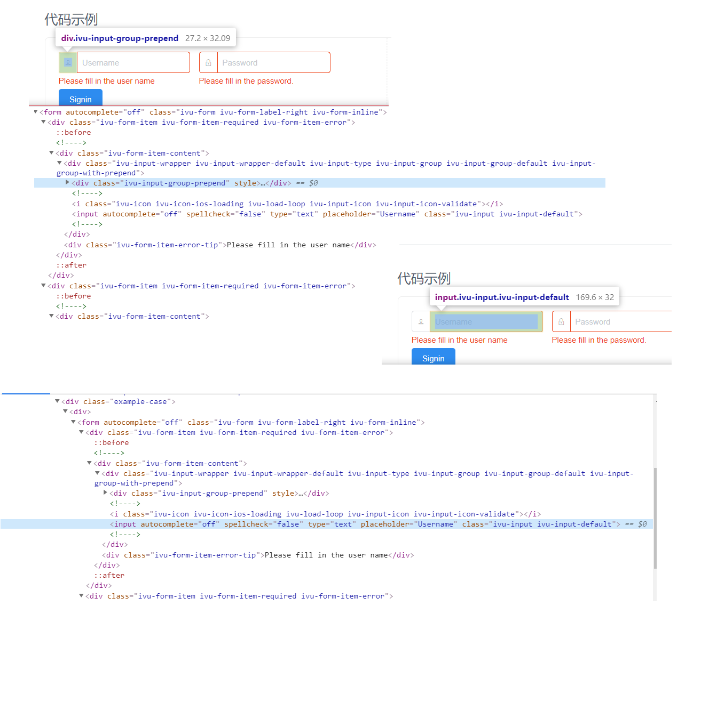
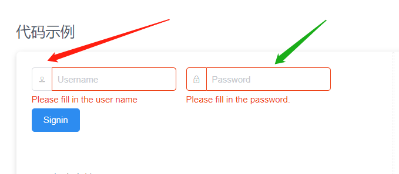

# 指南

## 入门

### 安装

您可以通过`npm`或`CDN`安装此插件。

```bash
npm install vcc-validate --save
```

### 用法

?>示例使用`ES2015`语法，如果您还没有，请确保在`ES2015`上使用。

```js
import Vue from 'vue';
import VccValidate from 'vcc-validate';
Vue.use(VccValidate);
```

或直接包含配置文件

```js
import VccValidate from 'vcc-validate';
import vccValidateConf from './conf/vccValidateConf';
Vue.use(VccValidate,vccValidateConf);
```

### 基本示例

<vuep template="#example"></vuep>

<script v-pre type="text/x-template" id="example">
<template>
    <div>
          <div>Hello, VccValidate!</div>
          <h2>实例</h2>
          <p>一个简单的 HTML 表单，包含两个文本输入框和一个提交按钮：</p>
          <div>
                First name:<br>
                <input type="text" v-model="firstname" v-vcc-field="'firstname'">
                <p class="validate-message"> {{vccTest.api().getMessagesOne('firstname')}}</p>
                Last name:<br>
                <input type="text" v-model="lastname" v-vcc-field="'lastname'">
                <p class="validate-message"> {{vccTest.api().getMessagesOne('lastname')}}</p>
                <button @click="submit">submit</button>
          </div>
    </div>
</template>

<script>
    module.exports = {
      data: function () {
        return {
              lastname:'',
              firstname: '',
              vccTest:new this.VccValidate()
        }
      },
      created: function () {
            this.vcc();
      },
      methods: {
            submit(){
                  this.vccTest.api().validate().then(res => {
                        if (this.vccTest.api().isValid()) {
                              alert('verify success')
                        }else{
                              alert('verify fail')
                        }
                  })
            },
            vcc(){
                  this.vccTest.init(this, {
                        openWarningLine: true,
                        fields: {
                              'lastname': {
                                    validators: {
                                          notEmpty: {
                                                message: "请填写lastname"
                                          },
                                    },
                              },
                              'firstname': {
                                    validators: {
                                          notEmpty: {
                                                message: "请填写firstname"
                                          },
                                    },
                              }
                        }
                  });
            }
      }
  
    }
</script>
</script>

您只需将 `v-vcc-field` 指令添加到要验证的HTML输入或Vue组件
然后，向指令传递一个 你想校验的字段名称。

```html
<el-input v-vcc-field="'userItem.lspuLoginName'" v-model="userItem.lspuLoginName"/>
```

要显示错误消息，我们只需使用该`api().getMessagesOne(fieldStr)`方法获取该字段错误:

```html
<el-input v-vcc-field="'modelForm[@userItem.lspuLoginName@]'" v-model="modelForm['userItem.lspuLoginName']">
<span class="validate-message"> {{vccTest.api().getMessagesOne('modelForm[@userItem.lspuLoginName@]')}}</span>
```

```js
export default {
      name: "userControlList",
      data() {
              return {
                    vccTest: new this.vccValidator(),
                    message: 'Hello VccValidate!',
                    modelForm:{
                        'userItem.lspuLoginName':''
                    },
                    testSelect:''
              }
      },
      methods: {
            initVcc: () {
                         this.vccTest.init(this, {
                               openWarningLine: true,
                               fields: {
                                     'modelForm[@userItem.lspuLoginName@]': {
                                           validators: {
                                                 notEmpty: {
                                                       message: "请填写必填信息"
                                                 },
                                                 length: {
                                                       max: 10,
                                                       min: 2,
                                                       message: "min:2 max:10"
                                                 }

                                           }
                                     },
                                     'testSelect': {
                                           validators: {
                                                 notEmpty: {
                                                       message: "请选择必填信息"
                                                 },
                                                 length: {
                                                       max: 3,
                                                       min: 2,
                                                       message: "min:2 max:3"
                                                 }
                                           }
                                     },
                               }
                         });
            }
      }
}
```

## 更新日志

### 1.1.0

+ 新增功能: 个性化错误提示(Node Mapping Function) 完全可以自定义错误提示的样式 ~~~棒 :100:
+ 新增功能: 教程文档更新,demo 完善
+ 新增功能: 支持vue 动态添加data属性 进行validate

## 显示错误

### 显示单个错误消息

```html
<el-input type="text"    v-vcc-field="'lspuEmail'" v-model="lspuEmail']">
<span>{{ vccTest.api().getMessagesOne('lspuEmail')}}</span>
```

### 显示多条错误消息

```html
<ul>
  <li  :key="error._uuid" v-for="error in vccTest.api().getMessages('modelForm[@userItem.lspuEmail@]')">{{ error.message }}</li>
</ul>
```

```js
//显示多条错误消息-数据格式:
[ { "validatorRuleName": "notEmpty", "message": "请填写邮箱地址" }, { "validatorRuleName": "isEmail", "message": "请输入正确的邮箱格式" } ]
```

### 显示所有错误

```html
    <ul>
      <li :key="error._uuid" v-for="error in vccTest.api().getMessagesList()">{{ error.message }}</li>
    </ul>
```

```js
//显示所有错误-数据格式:
 [{
             validatorRuleName: "notEmpty",
             message: "请填写必填信息",
             field: "modelForm['userItem.lspuLoginName']"
       },
       {
             validatorRuleName: "length",
             message: "min:2 max:10",
             field: "modelForm['userItem.lspuLoginName']"
       }
 ]
```

## 验证规则

VccValidate提供了一系列开箱即用的验证规则，它们都是本地化的，涵盖了大多数验证需求：

### different

```js
/**
 * different
 * zh-cn:输入值与给定字段的值不同 如果验证相同,则验证失败.
 * en-us:The input value is different from the value of the given field. If the verification is the same, the verification fails.
 * 只支持基本类型比较
 *
 * @param {Object} $field Field element
 * @param {Object} options Field options
 * @param {Map} allFieldValMap 所有验证字段的 val
 * @returns {Boolean} true:不通过 false:通过
 */
      different: {
            field: 'newPassword',
            message: "输入值与给定字段的值不同"
      }
      // field 表示当前field验证完成,触发另一个field的验证 必填
	  // 验证列表中的 field
	  // 例如:在注册的时候验证两个密码是否输入的一样
```

### callback

```js
/**
 * callback
 * zh-cn:回调验证器 可以用于 异步后端验证
 * en-us:callback can be use on Async Backend Validation
 *
 * @param {Object} $field Field element
 * @param {Object} options Field options
 * @returns {Boolean} true:不通过 false:通过
 */

    callback: {
          message: "此邮箱已经存在",
          callback: function (value, $field, validateRule, allFieldValMap) {
                // true:不通过 false:通过
                return ['123@www.com', '333@www.com'].includes(value);
          },
    }
```

### isEmail

```js
/**
 * isEmail
 * zh-cn:检查字符串是否是电子邮件.
 * en-us:check if the string is an email.
 *
 */
```

### contains

```js
/**
 * contains
 * zh-cn:检查字符串是否包含种子.
 * en-us:check if the string contains the seed.
 *
 */
    contains: {
          message: "检查字符串是否包含种子",
          seed: ""
    }
```

### equals

```js
/**
 * equals
 * zh-cn:检查字符串是否与比较匹配.
 * en-us:check if the string matches the comparison.
 *
 */
    equals: {
          message: "检查字符串是否与比较匹配",
          comparison: "123456",
    }
```

### isAfter

```js
/**
 * isAfter
 * zh-cn:检查字符串是否是指定日期之后的日期（默认为现在）.
 * en-us:check if the string is a date that's after the specified date (defaults to now).
 *
 */
```

### isBefore

```js
/**
 * isBefore
 * zh-cn:检查字符串是否是指定日期之前的日期
 * en-us:check if the string is a date that's before the specified date.
 *
 */
 ```

### isAlpha

```js
/**
 * isAlpha
 * zh-cn:检查字符串是否只包含字母(a-zA-Z)
 * en-us:check if the string contains only letters (a-zA-Z).
 *
 */
```

### isAlphanumeric

```js
/**
 * isAlphanumeric
 * zh-cn:检查字符串是否只包含字母和数字
 * en-us:check if the string contains only letters and numbers.
 *
 */
 ```

### isAscii

```js
/**
 * isAscii
 * zh-cn:检查字符串是否仅包含ASCII字符.
 * en-us:check if the string contains ASCII chars only.
 */
 ```

### isBase64

```js
/**
 * isBase64
 * zh-cn:检查字符串是否为base64编码.
 * en-us:check if a string is base64 encoded.
 *
 */
 ```

### isBoolean

```js
/**
 * isBoolean
 * zh-cn:检查字符串是否是布尔值.
 * en-us:check if a string is a boolean.
 *
 */
 ```

### isFloat

```js
/**
 * isFloat
 * zh-cn:检查字符串是否为浮点数.
 * en-us:check if the string is a float.
 *
 */
 ```

### isInt

```js
/**
 * isInt
 * zh-cn:检查字符串是否为整数.
 * en-us:check if the string is an integer.
 */
 ```

### length

```js
/**
 *
 * length
 * zh-cn:至少需要一个min和max选项.
 * en-us:min and max options is required.
 */
 ```

### notEmpty

```js
/**
* notEmpty
* zh-cn:检查输入值是否为空
* en-us:Check if input value is empty or not
*/
 ```

### regexp

```js
/**
* regexp
* zh-cn:检查值是否与给定的Javascript正则表达式匹配
* en-us:Check if the value matches given Javascript regular expression
*/

    regexp: {
          reg: /^\w{3,20}$/,
          message: "检查值是否与给定的Javascript正则表达式匹配"
    },
 ```

### isURL

```js
/**
 * isURL
 * zh-cn:检查字符串是否为URL.
 * en-us:check if the string is an URL.
*/
 ```

### isUppercase

```js
/**
 * isUppercase
 * zh-cn:检查字符串是否为大写.
 * en-us:check if the string is uppercase.
*/
 ```

### isNumeric

```js
/**
 * isNumeric
 * zh-cn:检查字符串是否只包含数字.
 * en-us:check if the string contains only numbers.
*/
 ```

## 自定义规则

### 创建自定义规则

```js
  this.VccValidate.Rules.extend('test', {
        /**
         * @param {Object} value value
         * @param {fieldName:'当前验证字段名称',oldVal:'上一次输入的数据'} $field 验证字段的一些信息
         * @param {随意定义这个对象的属性} validateRule 规则对象
         * 例如:
         * length: {
         *       max: 6,
         *       min: 2,
         *       message: "用户名长度最大6,不能低于2位"
         * }
         * length就是 validateRule 规则对象
         * 你可以随意定义 validateRule里的属性
         * @returns {Boolean} true:不通过 false:通过
         */
        validate: function (value, $field, validateRule) {
              //todo 你的逻辑
              return false;
        }
  });
```

### 全局配置项 自定义规则

```js
RULES: {
    "isPhone": {
      // @returns {Boolean} true:不通过 false:通过
      validate: function (value, $field, validateRule, allFieldValMap) {
        //todo 你的逻辑
        return false;
      }
    }
}
```

### 使用规则

!>注意 message 是必须填写的

``` js
   'modelForm[@userItem.lspuPassword@]': {
         validators: {
               test: {
                     message: "请输入密码"
               },
         }
   }
```

### 规则里的关键字 triggerField

triggerField 关键字 代表了 当前验证字段 验证完成后 去触发另一个 "field" 的验证

例如: 在注册的账号的时,要输入两次密码
Password , Confirm Password


这时候 两个校验的字段上就要使用 triggerField

## 全局 Node Mapping 指令

全局指令是为了快速的找到  HTML输入或Vue组件  BorderColor.

采用了配置的方式例如:

```js
findBorderColorCmd={
'input':['=','[1]','-','>'],
'el-input':['=','-','<']
}
```

* `<`:上一个同胞元素
* `>`:下一个同胞元素
* `+`:父元素
* `-`:子元素
* `[x]`: x 如节点有多个 x 代表第几个

### 附加

例如: 遇到下图这个情况如何进行 Node Mapping


很明显 这个是一个输入框组件 分为两个部分 一个 icon 一个input.  

Node Mapping 指令只能选择一个,那么另一部分不要了?



显然是不可能的,这时候就用到了  Node Mapping Function 

### 个性化错误提示(Node Mapping Function)

Node Mapping Function ~棒 :100:

* `field`:验证的字段名称
* `error`:是否错误
* `errorList`:错误信息
* `nodeList`:字段对应的 组件或者node(tag)
* `oldState`:上一次的验证状态

```js
    'xx-input':function(field,error,errorList,nodeList,oldState){
          // todo 你的逻辑
    }
```


## 配置项

### 全局配置项 VccValidateConf

```js
import VccValidate from 'vcc-validate';
import vccValidateConf from './conf/vccValidateConf'
Vue.use(VccValidate,vccValidateConf);
```

>vccValidateConf.js
```js

const mappingFunction={
    'xx-input':function(field,error,errorList,nodeList,oldState){
      //todo 你的逻辑
    }
}

const config={
  tagMapping:{},
  debugLog:true,
  RULES:{},
  mappingFunction:mappingFunction
}
export default config;
```

|Property       | Type      | Default   | Description  |
|:--------------|:---------:|:---------:|:---------|
| tagMapping    | `object`  |           | 全局 Node Mapping 指令. |
| debugLog      | `boolean` | `false`   | debugLog. |
| RULES      		 | `object` |    | 自定义规则 |


### 实例配置项

#### openWarningLine

是否打开警告线  默认 false

#### warningLineColor

警告线颜色 默认 red

```js

    /**
     * 自动 （禁用|启用） 提交按钮  默认 false
     * 如果验证不通过将会 禁用提交按钮 通过则启用
     * ps:请使用 v-vcc-submit-button 标注你的 提交按钮
     */
    autoDisableEnableSubmitButton: false,
    /**
     * v-vcc-submit-button 对应的 value  
     */
    submitButtonName: '',
    fields: {}
```

```js
      this.vccTest.init(this, {
          openWarningLine: true,
          fields: {}
      })
      // or
      data() {
            return {
                  vccTest:new this.VccValidate(this,{
                        openWarningLine: true,
                        fields: {}
                  })
            }
      }

```

## 指令

### v-vcc-field

 用于验证字段

### v-vcc-submit-button

 用于form 表单的提交button上
 防止表单中按钮进行表单验证

 验证完成自动启用,未完成处于禁用状态


 ps:可以手动控制 请参考 disableEnableSubmitButton

## API

以下是插件提供的公共方法列表。

### addField

```js
      /**
       * 添加新字段
       * @param {String} fieldStr
       * @param {Object} options
       * @param {Boolean} immediate 是否立刻验证 默认 false
       */
      addField: function (fieldStr, options, immediate = false)
```

### removeField

删除给定的字段

```js
      /**
       * 添加新字段
       * @param {String} fieldStr
       */
      removeField: function (fieldStr)
```

### resetField

重置给定字段

```js
      /**
       * 重置给定字段
       */
      resetField: function (fieldStr)
```

### destroy

销毁插件

**`通常情况下你不需要关心当前验证的销毁,它会伴随着vue指令销毁一块销毁`**


**`一切都处理好了 啊啊啊`**


### validate

手动验证表单。当您想要通过单击按钮或链接而不是提交按钮来验证表单时，它非常有用.

### isValid

如果所有表单字段都有效，则返回 true。否则，返回false.     


参数 @param {Boolean} isDestroy 验证通过就销毁插件执行 `destroy` true 销毁  false 不销毁 `默认false`

### disableEnableSubmitButton

禁用或启用提交按钮

```js
      /**
       * 禁用或启用提交按钮
       * @param {*} cmd true 禁用 false 不禁用
       */
      disableEnableSubmitButton: function (cmd);

      // 调用方式:
      vccTest.api().disableEnableSubmitButton(false);
```

### updateStatus

更新给定字段的验证器结果

```js
      /**
      * 更新状态
      * @param fieldStr
      * @param status
      * @param validatorRuleName
      * */
      updateStatus: function (fieldStr, status, validatorRuleName)
```

### revalidateField

重新验证给定字段

```js
  /**
  * 重新验证给定字段
  * @param fieldStr
  */
  revalidateField: function (fieldStr)
```

### resetForm

 重置表格
 它隐藏所有错误元素和反馈图标,所有字段都标记为尚未验证

```js
      /**
      * 重置表格
      *
      */
      resetForm: function ()
```

### getMessagesOne

获取错误消息 one

```js
      /**
      * 获取错误消息
      * @param fieldStr
      * @param validatorRuleName 验证规则名称
      */
      getMessagesOne: function (fieldStr, validatorRuleName = null)
```

### getMessages

获取错误消息

```js
      /**
      * 获取错误消息
      * @param fieldStr
      * @param validatorRuleName 验证规则名称
      */
      getMessages: function (fieldStr, validatorRuleName = null)
```

### updateMessage

更新错误信息

```js
      /**
       * 更新错误信息
       * @param fieldStr
       * @param validatorRuleName 验证规则名称
       * @param message 更新的信息
       */
      updateMessage: function (fieldStr, validatorRuleName, message)
```

### getOptions

获取现场选项

```js
      /**
       * 获取现场选项
       * @param {String} fieldStr
       * @param {String} validatorRuleName
       * @param {String} option
       */
      getOptions: function (fieldStr, validatorRuleName, option)
```

### updateOption

更新特定验证器的选项

```js
   /**
    * 更新特定验证器的选项
    * @param {String} fieldStr
    * @param {String} validatorRuleName
    * @param {String|Object} option
    * @param {String|Object} value
    */
   updateOption: function (fieldStr, validatorRuleName, option, value)
```

### getValidateStatus

>获取验证的状态

>>**成功:SUCCESS**

>>**错误:ERROR**

>>**没验证:NO_VERIFY**

```js
      getValidateStatus: function (fieldStr)
```

## 概念

### 去抖（延迟）验证

// todo 1.1.2 完成
您可以指定延迟以对输入事件进行去抖动，您可能希望等待用户停止键入然后验证字段以限制验证触发频率。

这可以通过 data-vcc-delay 在要验证的字段上添加属性来实现，并为其分配您要等待的毫秒数。

### 异步后端验证

假设您要验证特定于您的应用领域的某些内容，这在客户端是不可行的。例如，检查电子邮件是否已注册。

```js
      fields: {
            'email ': {
                  validators: {
                        callback: {
                              message: "此邮箱已经存在",
                              callback: function (value, $field, validateRule, allFieldValMap) {
                                    // true:不通过 false:通过
                                    return ['123@www.com', '333@www.com'].includes(value);
                              },
                        }
                  },
            },
      }
```
